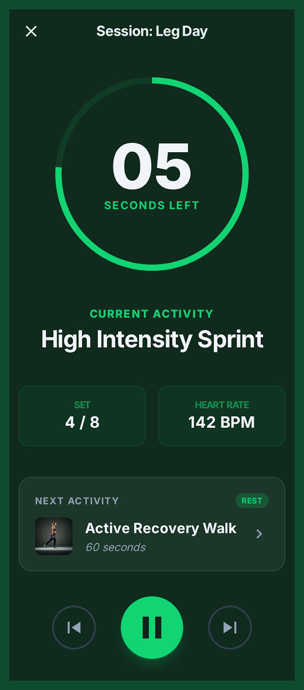

# CronTask - Cronômetro de Atividades Premium

Uma aplicação web moderna e minimalista para gerenciar sequências de atividades com foco em produtividade e exercícios. Desenvolvida em **React 19** com uma estética de alto nível (Glassmorphism Dark).



## ✨ Funcionalidades Principais

- 📝 **Lista de Tarefas Customizada**: Adicione etapas com descrições de até 180 caracteres.
- ⏱️ **Cronômetro Inteligente**: Tempo definido em minutos com precisão decimal.
- 🔄 **Fluxo de Execução Automatizado**:
  - Countdown de 5 segundos para preparação antes do início.
  - Transição automática entre atividades.
  - Tela de conclusão personalizada.
- 🚨 **Alertas Visuais**: A tela pulsa nos últimos 5 segundos de cada atividade para te alertar sem precisar olhar fixamente.
- 🔮 **Previsão da Próxima Etapa**: Saiba o que vem a seguir através de um card informativo durante a sessão ativa.
- 💾 **Persistência Local**: Suas configurações são salvas automaticamente no navegador (`localStorage`), funcionando totalmente offline após o primeiro carregamento.

## 🛠️ Stack Tecnológica

- **Core**: React 19 + Vite
- **Estilização**: CSS Vanilla (Variáveis, Flexbox/Grid) + Tailwind CSS para utilitários.
- **Animações**: Framer Motion
- **Ícones**: Lucide React
- **Testes**: Playwright (E2E)

## 🚀 Como Iniciar

### Pré-requisitos
- Node.js (v18+)
- npm ou yarn

### Instalação
```bash
# Clone o projeto (se aplicável) e entre na pasta
# Instale as dependências
npm install
```

### Execução Local
```bash
npm run dev
```
Acesse `http://localhost:5173`

## 🧪 Testes Automatizados (E2E)

O projeto conta com um plano de testes robusto utilizando **Playwright** para garantir que o cronômetro e a persistência nunca falhem.

Para executar os testes:
```bash
# Inicie o app em um terminal
npm run dev

# Em outro terminal, execute os testes
npx playwright test
```

## 📖 Estrutura de Pastas

- `/src/App.jsx`: Lógica central da aplicação (Timer Engine + Views).
- `/src/index.css`: Sistema de design (Variáveis, Animações e Glassmorphism).
- `/tests/`: Scripts de teste E2E.
- `/design_backup/`: Propostas visuais originais.

---
Desenvolvido com foco em UX e Design de interface.
